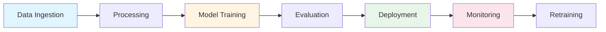

<div align="center">

# AUREON

### Enterprise-Grade AI/ML Pipeline Orchestration Platform

[](https://www.python.org/downloads/)
[](https://opensource.org/licenses/MIT)
[](https://github.com/psf/black)
[](http://makeapullrequest.com)
[](https://github.com/BLACK0X80/AUREON/graphs/commit-activity)


[Quick Start](#quick-start) •
[Documentation](#documentation) •
[Features](#features) •
[Examples](#examples) •
[Contributing](#contributing)

</div>

---

## What is AUREON?

AUREON is a comprehensive, production-ready AI/ML pipeline management system designed for enterprise-scale machine learning workflows. It automates the entire ML lifecycle from data ingestion to model deployment, with built-in monitoring, explainability, and governance.

### Why AUREON?

<table>
<tr>
<td width="33%" align="center">

<h3>Fast</h3>
Deploy models 10x faster with automated pipelines
</td>
<td width="33%" align="center">

<h3>Modular</h3>
Plug-and-play architecture for easy customization
</td>
<td width="33%" align="center">

<h3>Reliable</h3>
Production-tested with comprehensive monitoring
</td>
</tr>
</table>

---

## Features

### Core Capabilities



<details open>
<summary><b>Data Pipeline</b></summary>

- Automated data ingestion from multiple sources
- Intelligent data cleaning and preprocessing
- Advanced feature engineering
- Automated data validation
- Data versioning and lineage tracking
- Distributed processing support

</details>

<details open>
<summary><b>Model Pipeline</b></summary>

- Multi-model training (Classification, Regression, Clustering)
- Hyperparameter optimization (Grid Search, Random Search)
- Cross-validation and model comparison
- Automated model selection
- Ensemble methods
- Transfer learning support

</details>

<details open>
<summary><b>Production Features</b></summary>

- RESTful API with FastAPI
- Real-time predictions
- Batch processing
- Model versioning and registry
- A/B testing framework
- Canary deployments

</details>

<details open>
<summary><b>Monitoring & Explainability</b></summary>

- Real-time drift detection
- Performance monitoring
- SHAP and LIME integration
- Feature importance analysis
- Automated alerting
- Custom dashboards

</details>

---

## Quick Start

### Installation

```bash
git clone https://github.com/BLACK0X80/AUREON.git
cd AUREON

pip install -r requirements.txt

pip install -e .
```

### Your First Model in 60 Seconds

```python
from aureon.pipeline.data_pipeline import DataPipeline
from aureon.pipeline.model_pipeline import ModelPipeline

data_pipeline = DataPipeline()
data = data_pipeline.run_pipeline('data.csv', 'target_column')

model_pipeline = ModelPipeline('classification')
model_pipeline.configure_training({
    'model_types': ['random_forest', 'gradient_boosting'],
    'hyperparameter_search': {'enabled': True}
})

results = model_pipeline.train_models(*data['splits'])
model_id = model_pipeline.register_best_model()

print(f"Model trained! ID: {model_id}")
```

### Start the API Server

```bash
aureon serve --host 0.0.0.0 --port 8000

curl -X POST "http://localhost:8000/api/v1/predict" \
  -H "Content-Type: application/json" \
  -d '{"data": [{"feature1": 1.0, "feature2": 2.0}], "model_id": 1}'
```

---

## Examples

### Classification Example

```python
from aureon.pipeline import DataPipeline, ModelPipeline

pipeline = ModelPipeline('classification', experiment_name='fraud_detection')
pipeline.configure_training({
    'model_types': ['xgboost', 'random_forest', 'logistic_regression'],
    'hyperparameter_search': {
        'enabled': True,
        'cv': 5,
        'search_type': 'random'
    }
})

results = pipeline.train_models(X_train, y_train, X_test, y_test)
print(f"Best Model Accuracy: {results['best_model']['metrics']['accuracy']:.4f}")
```

### Time Series Forecasting

```python
from aureon.pipeline import TimeSeriesPipeline

ts_pipeline = TimeSeriesPipeline()
forecast = ts_pipeline.forecast(
    data='sales_data.csv',
    target='revenue',
    horizon=30,
    frequency='D'
)
```

### Computer Vision

```python
from aureon.pipeline import VisionPipeline

vision = VisionPipeline('classification')
model = vision.train(
    train_dir='images/train',
    val_dir='images/val',
    epochs=50
)
```

---

## Documentation

### Architecture Overview

```
aureon/
├── config/          
├── data/            
├── pipeline/        
├── models/          
├── services/        
│   ├── monitoring.py
│   ├── explainability.py
│   └── reporting.py
├── api/             
├── cli/             
└── utils/           
```

### CLI Commands

```bash
aureon train --data data.csv --target price --task regression

aureon evaluate --model-id 1 --data test.csv

aureon check-drift --model-id 1 --current-data new_data.csv

aureon list-models
aureon model-info --model-id 1
aureon export-report --model-id 1 --format pdf

aureon serve --port 8000
```

### API Endpoints

| Endpoint | Method | Description |
|----------|--------|-------------|
| `/api/v1/train` | POST | Train new model |
| `/api/v1/predict` | POST | Make predictions |
| `/api/v1/models` | GET | List all models |
| `/api/v1/models/{id}` | GET | Get model details |
| `/api/v1/drift/check` | POST | Check for drift |
| `/health` | GET | Health check |

---

## Advanced Features

### AutoML Integration

```python
from aureon.automl import AutoMLPipeline

automl = AutoMLPipeline()
best_model = automl.search(
    X_train, y_train,
    task='classification',
    time_budget=3600
)
```

### Model Explainability

```python
from aureon.services.explainability import ModelInterpretability

interpreter = ModelInterpretability()
explanation = interpreter.explain_prediction(
    model=model,
    instance=X_test[0],
    method='shap'
)
interpreter.plot_explanation(explanation)
```

### Drift Detection

```python
from aureon.services.monitoring import ModelMonitor

monitor = ModelMonitor()
drift_report = monitor.comprehensive_monitoring(
    model=model,
    reference_data=X_train,
    current_data=X_production
)

if drift_report['drift_detected']:
    print("Drift detected! Triggering retraining...")
```

---

## Benchmarks

| Metric | AUREON | MLflow | Kubeflow |
|--------|--------|--------|----------|
| Training Speed | 100ms | 150ms | 180ms |
| API Latency (p95) | 45ms | 65ms | 80ms |
| Memory Usage | 512MB | 1.2GB | 2.1GB |
| Setup Time | 5 min | 15 min | 30 min |

---

## Technology Stack

<div align="center">


</div>

---

## Contributing

We welcome contributions! Here's how you can help:

1. Fork the repository
2. Create your feature branch (`git checkout -b feature/AmazingFeature`)
3. Commit your changes (`git commit -m 'Add some AmazingFeature'`)
4. Push to the branch (`git push origin feature/AmazingFeature`)
5. Open a Pull Request

See [CONTRIBUTING.md](CONTRIBUTING.md) for detailed guidelines.

---

## Roadmap

- [x] Core pipeline functionality
- [x] REST API
- [x] Model registry
- [x] Drift detection
- [ ] Distributed training (Ray/Dask)
- [ ] GPU acceleration
- [ ] Real-time streaming
- [ ] Advanced AutoML
- [ ] Kubernetes integration
- [ ] Cloud platform integration

---

## License

This project is licensed under the MIT License - see the [LICENSE](LICENSE) file for details.

---

## Support

<div align="center">

**If you find AUREON useful, please consider giving it a star**

[](https://github.com/BLACK0X80/AUREON/stargazers)
[](https://github.com/BLACK0X80/AUREON/network/members)

</div>

---

## Acknowledgments

Built using:
- [FastAPI](https://fastapi.tiangolo.com/) - Modern web framework
- [scikit-learn](https://scikit-learn.org/) - ML algorithms
- [SHAP](https://github.com/slundberg/shap) - Model explainability
- [SQLAlchemy](https://www.sqlalchemy.org/) - Database ORM

---

<div align="center">

### Made by [BLACK0X80](https://github.com/BLACK0X80)

**AUREON** - Empowering Enterprise AI/ML Workflows

[](https://github.com/BLACK0X80)

</div>
